# HR Analytics: Employee Attrition Analysis and Prediction

##  Overview

This project analyses employee data from Salifort Motors to uncover factors driving staff attrition and build machine learning models to predict which employees are likely to leave. The goal is to support HR decisions with data-led insights and improve retention.

**Data Source**: [HR Analytics Dataset from Kaggle](https://www.kaggle.com/datasets/mfaisalqureshi/hr-analytics-and-job-prediction?select=HR_comma_sep.csv)

---

##  Business Context

Staff turnover is costly and disruptive. Salifort Motors’ HR team wants to identify employees at risk of leaving and understand the reasons behind their decisions. This will allow the company to proactively reduce recruitment costs and retain experienced staff.

---

##  Data Cleaning

The dataset includes 14,999 employee records and covers:

- Satisfaction level  
- Last evaluation score  
- Number of projects  
- Average monthly hours  
- Time at company (years)  
- Work accident history  
- Whether the employee left (target)  
- Promotion in the last 5 years  
- Department  
- Salary level  

**Cleaning Actions**:

- Removed 3,008 duplicate entries (~20%)  
- Standardised column names  
- Verified no missing values  

---

##  Exploratory Data Analysis (EDA)

### 1. Employee Tenure
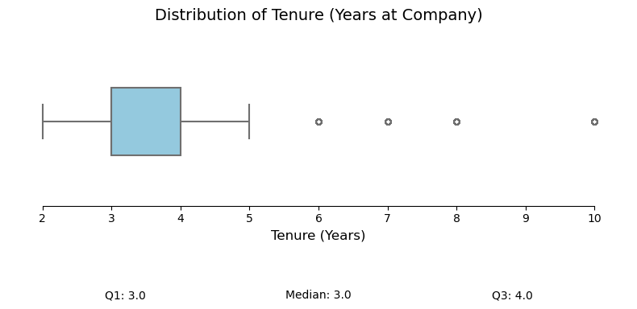

- Most employees have worked between 3 and 5 years.  
- Median tenure is 3 years.  
- Mid-career attrition is more common than early exits.

---

### 2. Satisfaction Level by Turnover  
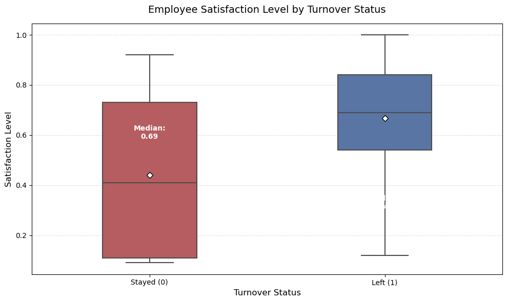

- Employees who left had lower satisfaction scores (median ~0.44).  
- Employees who stayed had higher satisfaction (median ~0.74).  
- Satisfaction is a strong indicator of retention.

---

### 3. Monthly Hours by Department  
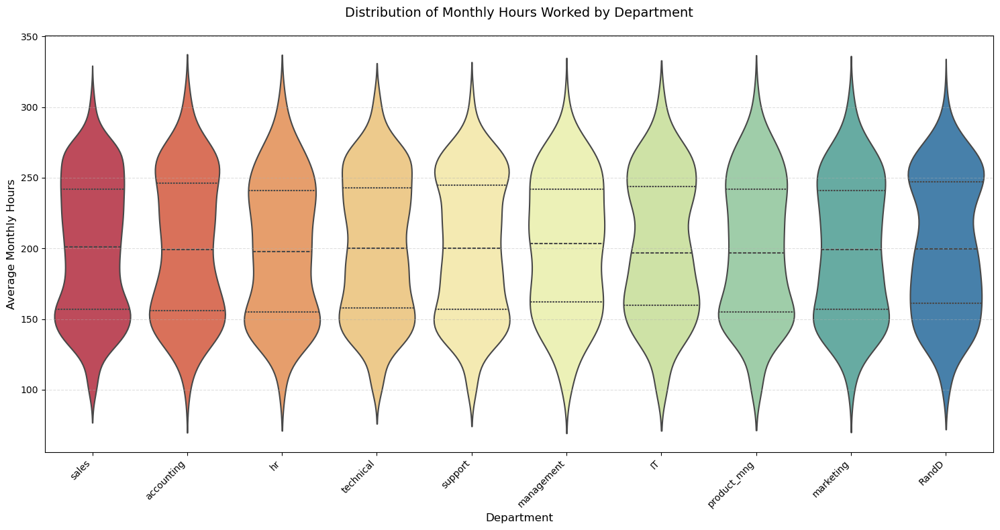

- Average workload varies across departments.  
- IT, Management, and R&D show wide variance in hours.  
- Suggests inconsistent workload distribution.

---

### 4. Turnover by Number of Projects  
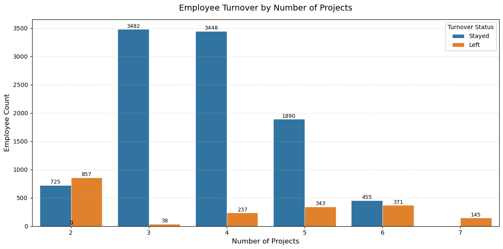

- Employees with only 2 projects had the highest attrition rate (65%).  
- Those with 3–5 projects had moderate attrition.  
- Very few left when assigned 6–7 projects.

---

### 5. Tenure Distribution by Turnover  
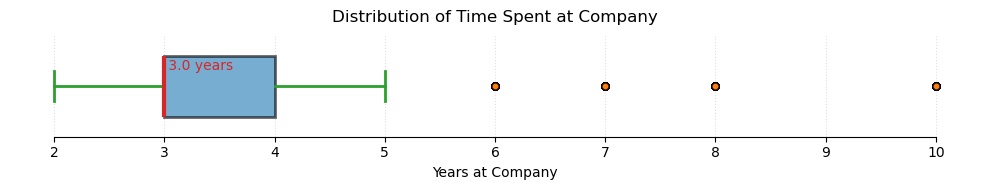

- Turnover peaks at 3–5 years.  
- Few new or long-tenured employees leave.  
- Risk is highest mid-way through tenure.

---

### 6. Turnover Rate by Department  
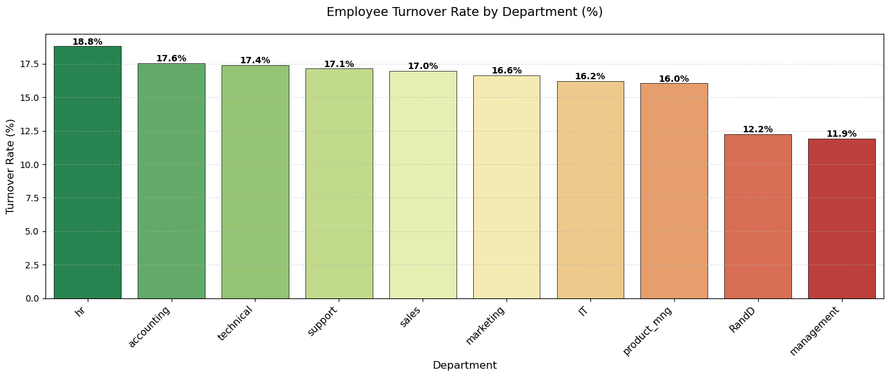

- HR (18.8%), Accounting (17.6%) and Technical roles (17.4%) had the highest attrition.  
- Management and R&D had the lowest rates.

---

### 7. Left vs Stayed by Department  
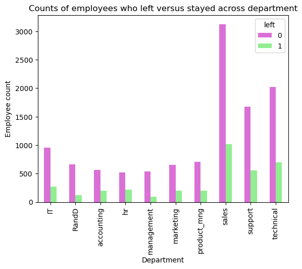

- Sales and Technical roles have high employee counts and departures.  
- Supports need for department-specific strategies.

---

### 8. Monthly Hours vs Satisfaction (by Turnover)  
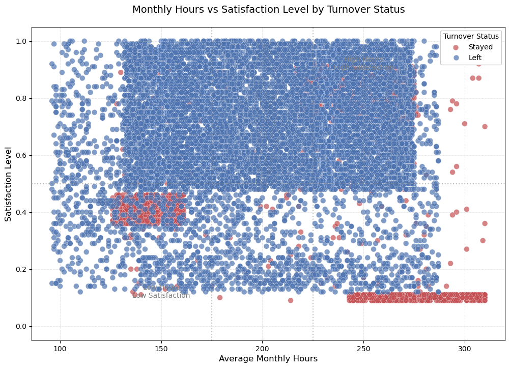

- Two risk clusters identified:  
  - Low satisfaction with moderate hours  
  - Moderate satisfaction with high hours  
- Both burnout and disengagement contribute to attrition.

---

### 9. Project Workload by Turnover  
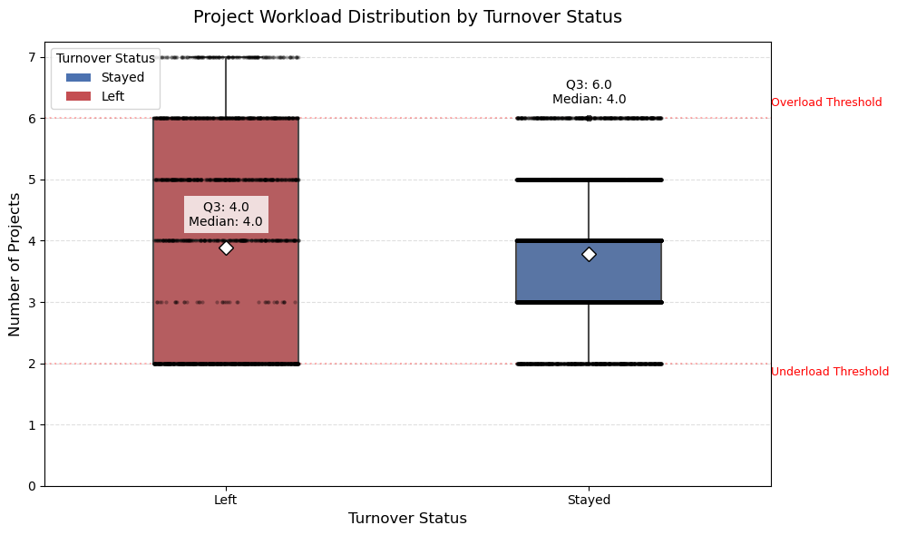

- Leavers had either too few or too many projects.  
- 3–5 projects were typical for retained staff.  
- Balanced workload reduces attrition risk.

---

### 10. Correlation Heatmap (Extended)  
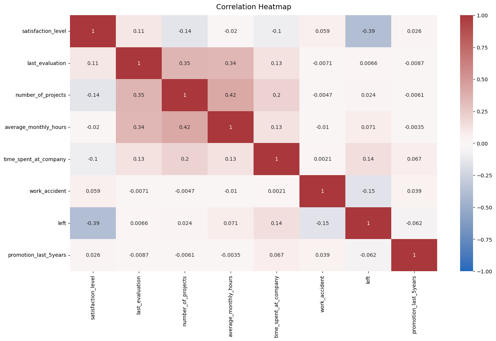

- Monthly hours and number of projects: strong correlation (0.42)  
- Satisfaction has strongest negative correlation with attrition (-0.39)

---

### 11. Correlation Heatmap (Trimmed)  
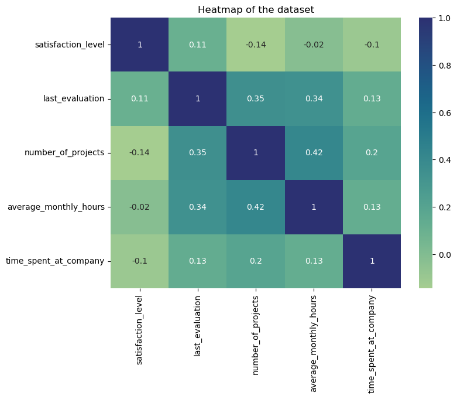

- Confirms satisfaction and workload as critical factors.  
- Evaluation and project count have positive influence on attrition.

---

##  Model Training & Evaluation

### Logistic Regression  
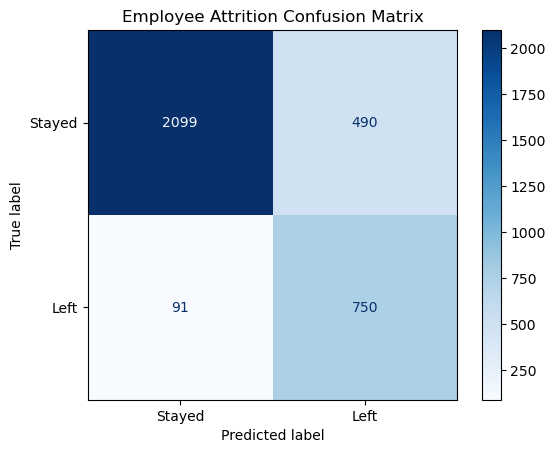

- **Accuracy**: 83%  
- **Precision (Left)**: 60%  
- **Recall (Left)**: 89%  
- Catches most leavers but includes false positives.

---

### Random Forest  
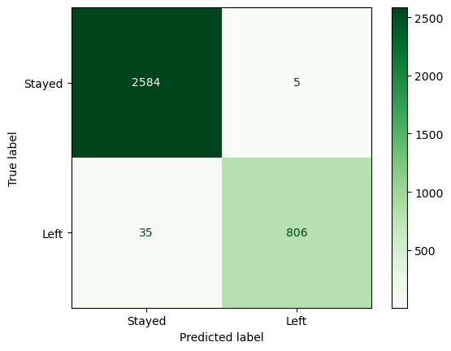

- **Accuracy**: 99%  
- **Precision (Left)**: 99%  
- **Recall (Left)**: 96%  
- High performance and low error—suitable for deployment.

---

##  Key Recommendations

- **Monitor Satisfaction Levels**  
  Employees with satisfaction <0.5 are at risk. Use pulse surveys and act on findings.

- **Balance Project Workload**  
  Avoid assigning only 2 projects. Ideal range: 3–5 projects.

- **Target Mid-Tenure Staff**  
  Attrition peaks at 3–5 years. Offer career advancement and mentoring.

- **Department-Specific Actions**  
  Focus on HR, Sales, and Accounting. Use exit interviews and focus groups.

- **Manage Monthly Hours**  
  Attrition increases below 175 or above 225 hours/month. Use scheduling tools.

---

##  Ethical Considerations

- Use model outputs to support—not punish—employees.  
- Protect confidentiality.  
- Focus on improving working conditions.

---

##  Final Thoughts

Satisfaction, tenure, and workload are the strongest drivers of attrition.  
The Random Forest model delivers near-perfect classification, making it a powerful tool for proactive HR decisions.

Salifort Motors can reduce hiring costs and retain talent by acting on these insights.

